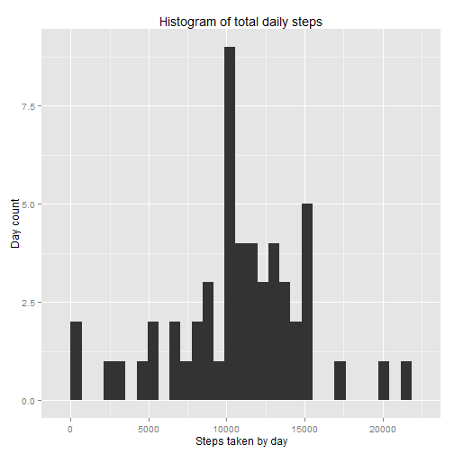
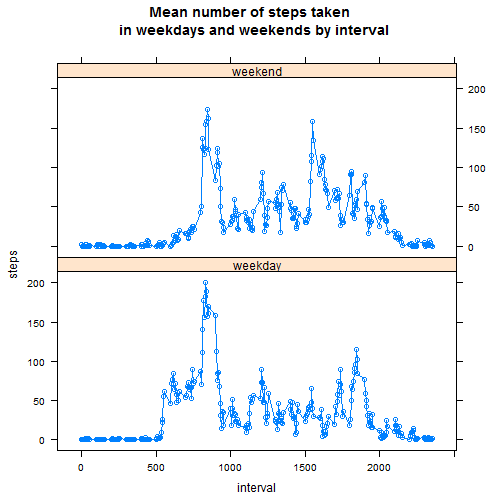

## 1. Loading and preprocessing the data

### 1.1 
Load the data and required packages


```r
library(ggplot2)
library(reshape2)
library(lattice)

setwd("~/DataScience/reproducible_research/project1")

data<-read.csv('activity.csv', stringsAsFactors=FALSE)
```


### 1.2 
Process and transform the data


```r
data$date<-as.Date(data$date)
```

## 2 Total number of steps per day


### 2.1
Calculate the total number of steps per day

```r
data2<-aggregate(steps ~ date, data=data, sum)
```

### 2.2
Histogram


```r
qplot(data2$steps, geom="histogram", xlab="Steps taken by day", ylab="Day count", main="Histogram of total daily steps") 
```

```
## stat_bin: binwidth defaulted to range/30. Use 'binwidth = x' to adjust this.
```

 

### 2.3
Mean and median of the total number of steps taken by day


```r
mean(data2$steps)
```

```
## [1] 10766.19
```

```r
median(data2$steps)
```

```
## [1] 10765
```

## 3 Average daily activity pattern

### 3.1
Time series plot of the 5 minute interval and the average number of steps taken, averaged across all days.


```r
data3<-aggregate(steps ~ interval, data=data, sum)

g<-ggplot(data=data3, aes(x=interval, y=steps)) + geom_line(size=.5) +ggtitle("Number of steps vs interval") + theme(plot.title = element_text(lineheight=.8, face="bold"))
```


### 3.2 
Which 5-minute interval, on average across all the days in the dataset, contains the maximum number of steps?


```r
data3$interval[data3$steps==max(data3$steps)]
```

```
## [1] 835
```

## 4 Inputing missing values

### 4.1
Calculate and report the total number of missing values.


```r
sum(is.na(data$steps))
```

```
## [1] 2304
```

### 4.2 
Fill the missing values (NAs) with the median of the relevant interval.


```r
data_median<-aggregate(steps ~ interval, data=data, median)

NA_idx<-is.na(data$steps)
intervals<-data$interval[NA_idx]
steps_median<-vector(mode="numeric", length=length(intervals))

for (i in 1:length(intervals)){
steps_median[i]<-data_median$steps[data_median$interval==intervals[i]]
}
```


### 4.3 
Create a new dataset where the NAs have been substituted.


```r
data5<-data
data5$steps[NA_idx]<-steps_median
```


### 4.4
Histogram of the total number of steps taken each day.


```r
data6<-aggregate(steps ~ date, data=data5, sum)
qplot(data6$steps, geom="histogram", xlab="Steps taken by day", ylab="Day count", main="Histogram of total daily steps (with NAs corrected)") 
```

```
## stat_bin: binwidth defaulted to range/30. Use 'binwidth = x' to adjust this.
```

 


Calculate and report the mean and median total number of steps taken per day. 


```r
mean(data6$steps)
```

```
## [1] 9503.869
```

```r
median(data6$steps)
```

```
## [1] 10395
```

Replacing the NAs has the effect of lowering the mean and median due to the fact that many NAs were replaced by zeroes.


## 5 Differences in activities between weekdays and weekend

### 5.1 
Create a new factor variable in the dataset with two levels -- "weekday" and "weekend" indicating whether a given date is a weekday or weekend day.


```r
data5$day<-weekdays(data5$date, abbreviate=TRUE)

for (i in 1:length(data5$date)) {

  if (data5$day[i] == "Mon" | data5$day[i] == "Tue" | data5$day[i] == "Wed" | data5$day[i] == "Thur" | data5$day[i] == "Fri") {

	data5$day[i]<-"weekday"

	}
	else {

	data5$day[i]<-"weekend"

	}
}
data5$day<-as.factor(data5$day)
```

## 5.2

Panel plot of the 5-minute interval (x-axis) and the average number of steps taken, averaged across all weekday days or weekend days (y-axis). 


```r
mdata<-melt(data5, id=c("date", "interval", "day"))

castdata<-dcast(mdata, day + interval~variable, mean)


xyplot(castdata$steps ~ castdata$interval | castdata$day, layout=c(1,2), xlab="interval", ylab="steps", type="b",  main="Mean number of steps taken \n in weekdays and weekends by interval" )
```

 


